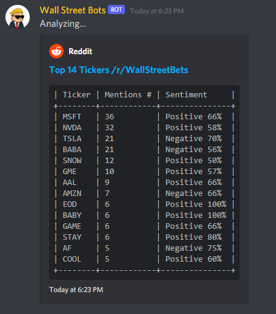

# /r/wallstreetbets Discord Bot

## Live demo: https://wallstreetbots.us

## Screenshot

## Original purpose
wsbtickerbot is a Reddit bot, developed utilizing the Reddit PRAW API, that scrapes the entirety of r/wallstreetbets over a 24 hour period, collects all the tickers mentioned, and then performs sentiment analysis on the context. The sentiment analysis is used to classify the stocks into three categories: bullish, neutral, and bearish.

While the intention of this bot was to simply create another talking point within the subreddit, it has evolved into much more. Future plans include, but are not limited to:
- Storing all collected data in a SQLite database
- Utilize this data to perform simple linear regression to determine market trends from mentions and sentiment from r/wallstreetbets

## Discord Bot Version

This fork is an implementation as a Discord bot:

- This version implements a useful Discord bot that you can interact with at any time.  

- This version stores all the comments in an SQL database using SQLAlchemy.  

## Data Sources:
- Data is downloaded from the official Nasdaq's website: https://www.nasdaq.com/market-activity/stocks/screener

### Check out the new version at https://wallstreetbots.us 